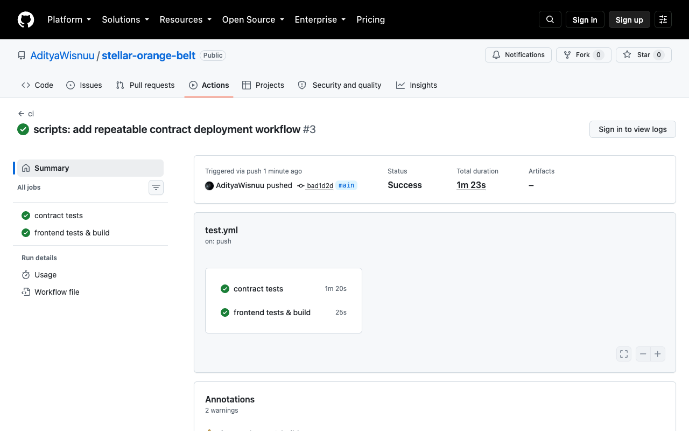
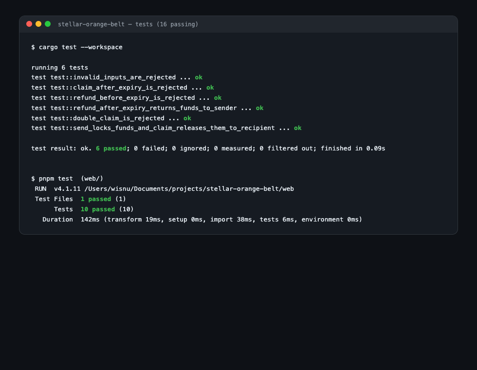
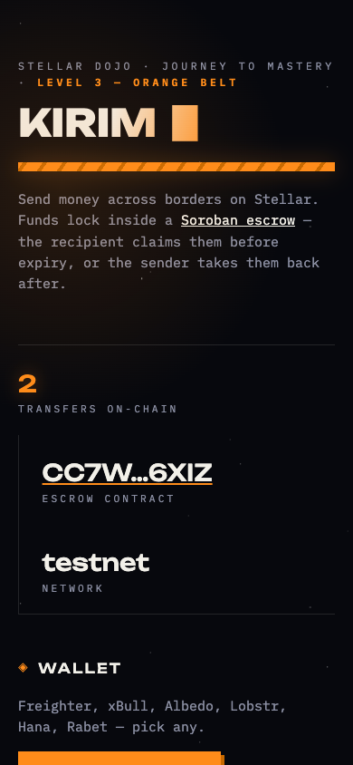

# 🧧 KIRIM — Orange Belt

Orange Belt submission for **Stellar Journey to Mastery: Monthly Builder Challenges** (Rise In × Stellar).

**🌐 Live demo: https://stellar-orange-belt.netlify.app** (Stellar testnet)

> Level 3 requirement: *Build a complete mini dApp with advanced smart contracts, testing, deployment.*

**KIRIM** (Indonesian for "send") is a mini cross-border remittance dApp. A sender locks XLM inside a Soroban escrow contract with a note and a claim window; the recipient claims the funds through a shareable link before expiry; after expiry, the sender can take the money back. Every state change is an on-chain event, streamed live into the UI.

## How each Level 3 requirement is covered

| Requirement | Where |
|---|---|
| Complete mini dApp | Full product loop: send → shareable claim link (`?id=N`) → claim / refund, with live activity feed and wallet-aware action guards |
| Advanced smart contracts | `contracts/kirim`: escrow holding funds in the contract, **inter-contract communication** (cross-contract calls into the native XLM Stellar Asset Contract via `token::Client` for lock/release/refund), per-transfer **persistent storage** with TTL extension, **time-lock** logic (claim before expiry / refund after), status lifecycle (`Pending → Claimed / Refunded`), dual-sided auth (recipient claims, sender refunds), custom errors, structured events |
| Testing | **16 tests**: 6 contract tests (`cargo test` — happy path, refund after expiry, claim-after-expiry rejected, premature refund rejected, double-claim rejected, input validation) + 10 frontend unit tests (`vitest` — formatting, status mapping, error translation, expiry countdown) |
| Deployment | Deployed to testnet with constructor args (`scripts/deploy.sh`); frontend deployed on Netlify; **CI/CD**: GitHub Actions runs contract tests + frontend tests + production build on every push |

## Deployed on testnet

- **Contract:** [`CC7WCFBM2CRUW36KTJZB67SJTSX3XHXCO7J2IJDILETKP4OFQHBT6XIZ`](https://stellar.expert/explorer/testnet/contract/CC7WCFBM2CRUW36KTJZB67SJTSX3XHXCO7J2IJDILETKP4OFQHBT6XIZ)
- **Proof of the full escrow loop on-chain:**
  - `send` — [`59a8077d…`](https://stellar.expert/explorer/testnet/tx/59a8077dac164b8df17de944120f1f6794f7e529ba8240816ef8a0d5fa6e0552) locks 50 XLM, emits `(kirim, sent, 0)`
  - `claim` — [`fb66ab33…`](https://stellar.expert/explorer/testnet/tx/fb66ab33be09aa5778bcf197ce648c9163bc54621baf114dc9333ea989216e96) releases 50 XLM to the recipient, emits `(kirim, claimed, 0)`
  - `refund` — [`7df1ddb4…`](https://stellar.expert/explorer/testnet/tx/7df1ddb4d78646a0f9b0a3f61ffa5bbed3fb207613caab815d4884f2bca025c8) returns an expired transfer (#1, 3 XLM) to the sender, emits `(kirim, refunded, 1)` — and rejects premature refunds with `NotExpiredYet`

## Error handling

Six contract error types are enforced on-chain and surfaced as readable messages in the UI:

| Code | Error | Trigger |
|---|---|---|
| `#1` | `InvalidAmount` | amount <= 0 |
| `#2` | `InvalidTtl` | claim window outside 1 minute - 30 days |
| `#3` | `NotFound` | unknown transfer id |
| `#4` | `NotPending` | transfer already claimed or refunded |
| `#5` | `Expired` | claiming after the window closed |
| `#6` | `NotExpiredYet` | refunding before the window closed |

The frontend maps each code to a human-readable message, guards actions by role (only the recipient sees Claim, only the sender sees Refund), and shows every transaction phase: building -> simulating -> signing -> submitting -> confirmed.

## Contract API

| Function | Auth | Description |
|---|---|---|
| `send(sender, recipient, amount, memo, ttl_ledgers) -> u64` | sender | Locks funds, stores the transfer, emits `(kirim, sent, id)` |
| `claim(id)` | recipient | Releases funds before expiry, emits `(kirim, claimed, id)` |
| `refund(id)` | sender | Returns funds after expiry, emits `(kirim, refunded, id)` |
| `get_transfer(id) -> Transfer` | — | Reads one transfer (sender, recipient, amount, memo, expiry, status) |
| `count() -> u64` | — | Total transfers ever created |

## Proof & screenshots

| | |
|---|---|
| CI pipeline (both jobs green) |  |
| Test output — 16 passing |  |
| Mobile responsive UI (390px) |  |

## Demo video

▶️ **[Watch the 1-minute demo](https://youtu.be/fzgvDW8XMyk)** — every transfer in the video was sent, claimed, and refunded live on testnet during recording.

## Run it

```bash
# Contract: test & build
cargo test
stellar contract build

# Deploy your own instance (constructor arg: accepted token — native XLM SAC)
stellar contract deploy \
  --wasm target/wasm32v1-none/release/kirim.wasm \
  --source deployer --network testnet \
  -- --token $(stellar contract id asset --asset native --network testnet)

# Frontend
cd web
pnpm install
pnpm dev
```

## Stack

- **Contract:** Rust, `soroban-sdk` (persistent storage + TTL, ledger time-locks, token client, custom errors, events, testutils)
- **Frontend:** Vite + vanilla JS, `@stellar/stellar-sdk` (Soroban RPC), `@creit.tech/stellar-wallets-kit` (Freighter, xBull, Albedo, Lobstr, Hana, Rabet)
- **Network:** Stellar testnet

## The bigger picture

KIRIM is the seed of a real product: cross-border remittance (Indonesia ⇄ overseas) on Stellar rails — the chain built for payments, anchors, and stablecoins. This mini dApp is the Level 3 prototype; the production MVP (Green Belt and beyond) extends it with stablecoin support, anchors, and fiat on/off-ramps.

## Author

Aditya Wisnu Wardana — [@AdityaWisnuu](https://github.com/AdityaWisnuu) · [White Belt](https://github.com/AdityaWisnuu/stellar-white-belt) · [Yellow Belt](https://github.com/AdityaWisnuu/stellar-yellow-belt)
